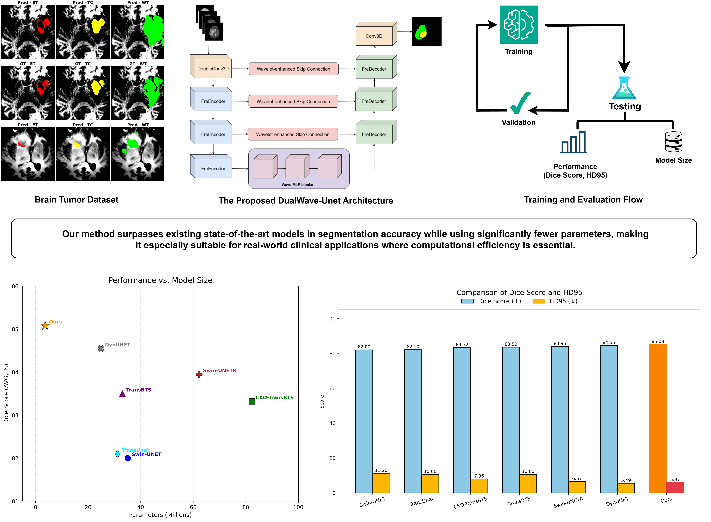
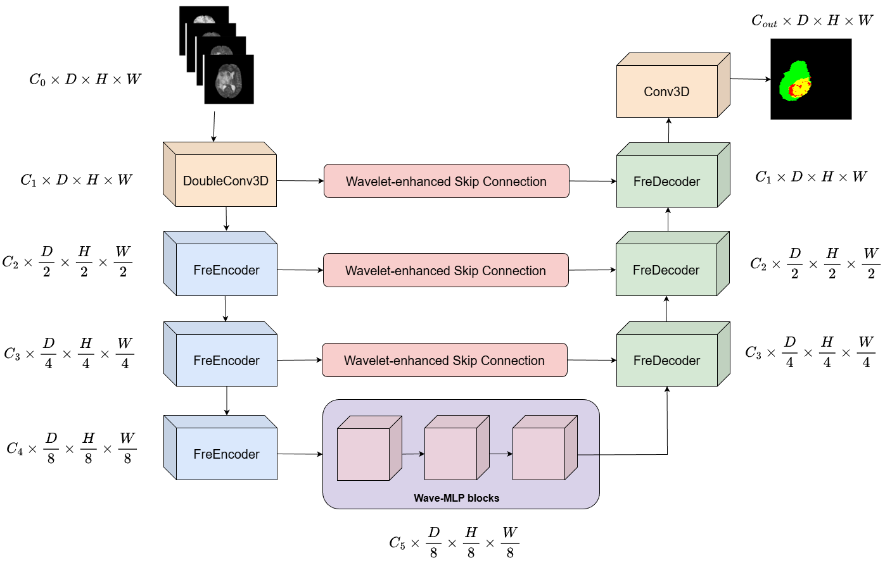
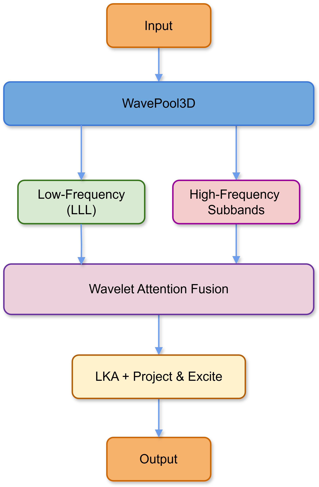
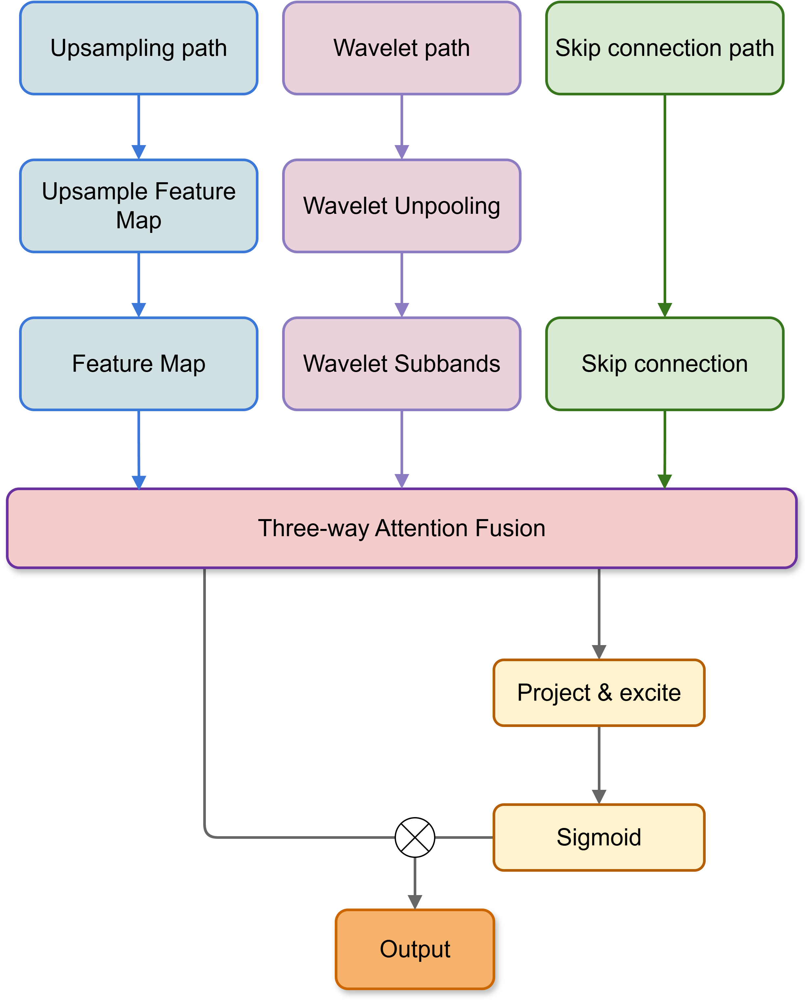
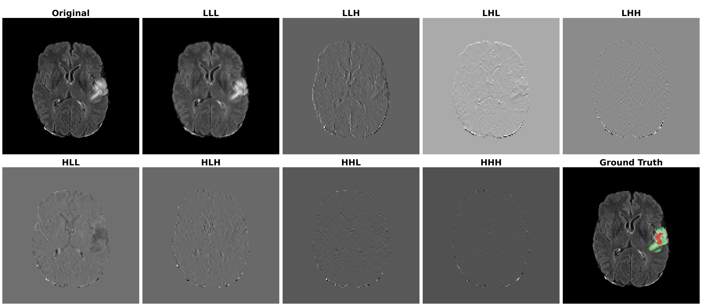
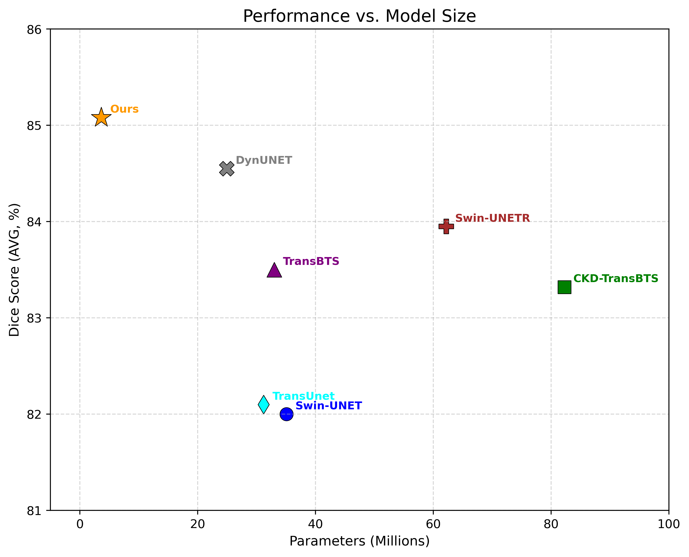
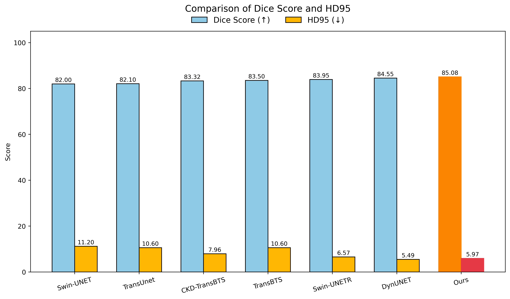

# DualWave-UNet

<p align="center">
  <b>Reimagining 3D U-Net with Wavelet-Preserved Encoding and Wave-MLP-Driven Adaptive Fusion for Brain MRI</b>
</p>

<p align="center">
  <a href="https://github.com/gryffin-uit-alpha/LW-DualWave-Unet"></a>
  <a href="https://huggingface.co/KhoaHuynh/DualWave-UNet"></a>
  
  
</p>

<p align="center">
  
</p>

## Abstract

Brain tumor segmentation in multi-modal MRI requires accurate volumetric delineation while remaining practical for clinical hardware. DualWave-UNet is a lightweight 3D segmentation architecture that replaces irreversible pooling with 3D Haar wavelet decomposition, models global context with WaveBlock3D and Phase-Aware Token Mixing 3D (PATM3D), and reconstructs features through FreDecoder blocks that fuse upsampled, skip-connected, and wavelet-reconstructed pathways.

On BraTS2020, DualWave-UNet reaches an average Dice score of **85.08** with only **3.65M parameters**, making it substantially smaller than transformer-heavy and large 3D CNN baselines while preserving competitive boundary quality.

## Highlights

- 3D Haar wavelet encoding preserves the LLL structural component and seven high-frequency subbands instead of discarding detail through pooling.
- WaveBlock3D with PATM3D performs phase-aware token mixing for efficient 3D context modeling.
- FreDecoder performs three-way adaptive fusion over learned upsampling, encoder skip features, and wavelet reconstruction.
- The paper configuration uses 3.65M parameters and reports strong Dice/HD95 results across BraTS2018, BraTS2020, and BraTS2021.

## Architecture

<p align="center">
  
</p>

DualWave-UNet follows a U-Net style encoder-decoder design with four main components:

1. **Wavelet-preserved encoding:** `FreEncoder` uses `WavePool3D` to decompose features into eight Haar subbands: LLL, LLH, LHL, LHH, HLL, HLH, HHL, and HHH.
2. **Frequency attention fusion:** high-frequency components are projected and adaptively fused with the low-frequency pathway to preserve tumor boundaries.
3. **Wave-MLP bottleneck:** `WaveBlock3D` and `PATM3D` use amplitude and phase modulation to mix 3D tokens with lower complexity than standard self-attention.
4. **Three-way reconstruction:** `FreDecoder` combines transposed-convolution upsampling, skip connections, and wavelet unpooling with learned fusion weights.

| FreEncoder | FreDecoder |
| --- | --- |
|  |  |

## Wavelet Decomposition

<p align="center">
  
</p>

The LLL component retains coarse anatomical structure, while LLH/LHL/LHH/HLL/HLH/HHL/HHH capture directional high-frequency detail. This design is intended to protect thin enhancing tumor regions and boundary information that can be lost by max pooling.

## Main Results

### BraTS2020

| Model | ET Dice | TC Dice | WT Dice | Avg Dice | ET HD95 | TC HD95 | WT HD95 | Avg HD95 | Params (M) |
| --- | ---: | ---: | ---: | ---: | ---: | ---: | ---: | ---: | ---: |
| Swin-UNet | 79.00 | 77.60 | 89.30 | 82.00 | 11.00 | 13.60 | 7.90 | 11.20 | 35.07 |
| TransUNet | 78.40 | 78.40 | 89.50 | 82.10 | 12.90 | 12.80 | 6.00 | 10.60 | 31.20 |
| CKD-TransBTS | 78.72 | 83.77 | 87.48 | 83.32 | 5.24 | 5.84 | 9.79 | 7.96 | 82.28 |
| TransBTS | 78.70 | 81.70 | 90.10 | 83.50 | 12.90 | 12.80 | 6.00 | 10.60 | 32.99 |
| SwinUNETR | 78.53 | 83.51 | 89.80 | 83.95 | 4.08 | 8.43 | 7.22 | 6.57 | 62.19 |
| DynUNet | 78.17 | 85.44 | 90.05 | 84.55 | 5.22 | 5.45 | 5.82 | 5.49 | 24.93 |
| **DualWave-UNet** | **79.52** | **85.01** | **90.73** | **85.08** | **5.14** | **6.02** | **6.75** | **5.97** | **3.65** |

| Parameters vs. Dice | Dice and HD95 |
| --- | --- |
|  |  |

### Cross-Dataset Summary

| Dataset | ET Dice | TC Dice | WT Dice | Avg Dice | Avg HD95 | Params (M) |
| --- | ---: | ---: | ---: | ---: | ---: | ---: |
| BraTS2018 | 75.47 | 83.38 | 89.87 | 82.90 | 6.25 | 3.65 |
| BraTS2020 | 79.52 | 85.01 | 90.73 | 85.08 | 5.97 | 3.65 |
| BraTS2021 | 88.04 | 91.20 | 92.60 | 90.61 | 4.29 | 3.65 |

### Efficiency

| Model | FLOPs (G) | Peak GPU Mem (GB) | Latency |
| --- | ---: | ---: | ---: |
| SwinUNETR | 1484.81 | 4.66 | 585.20 +/- 0.78 ms |
| DynUNet | 5434.25 | 3.38 | 542.58 +/- 0.15 ms |
| **DualWave-UNet** | **1099.37** | **4.53** | **1676.41 +/- 0.43 ms** |

The paper notes that the current latency is dominated by unoptimized wavelet unpooling through grouped transpose convolutions. Custom CUDA kernels or hardware-aware operator fusion are expected to improve deployment speed.

## Qualitative Results

<p align="center">
  
</p>

Tumor subregions follow the BraTS convention: **ET** for enhancing tumor, **TC** for tumor core, and **WT** for whole tumor.

## Repository Layout

```text
.
|-- DualWave-Unet.ipynb          # End-to-end notebook for data setup, training, and evaluation
|-- data/
|   |-- dataset.py               # BraTS dataset loader and split utilities
|   `-- preprocessing.py         # Cropping, padding, and normalization helpers
|-- models/
|   |-- Unet.py                  # DualWave-UNet model definition
|   |-- base_blocks.py           # FreEncoder/FreDecoder-style building blocks
|   |-- attention_blocks.py      # PATM3D, WaveBlock3D, LKA, Project & Excite
|   `-- wavelet_blocks.py        # WavePool3D, WaveUnpool3D, wavelet attention fusion
|-- utils/
|   |-- losses.py                # Dice, Focal Tversky, and combined losses
|   `-- metrics.py               # Training meters
`-- img/                         # Paper figures used in this README
```

## Installation

Create an environment with PyTorch and the medical-imaging dependencies used by the notebook:

```bash
pip install torch torchvision torchaudio
pip install monai SimpleITK scikit-learn timm einops nibabel opencv-python pandas matplotlib tqdm wandb
```

The current repository is notebook-first. Use `DualWave-Unet.ipynb` for the full training and evaluation workflow.

## Data Preparation

The experiments use BraTS2018, BraTS2020, and BraTS2021 multi-modal MRI volumes. Each patient folder is expected to contain:

```text
{patient_id}_t1.nii
{patient_id}_t1ce.nii
{patient_id}_t2.nii
{patient_id}_flair.nii
{patient_id}_seg.nii
```

Preprocessing follows the paper setup:

- co-registration, skull stripping, and 1 mm isotropic resampling from the BraTS release;
- foreground cropping and padding/cropping to `128 x 128 x 128`;
- modality-wise z-score normalization;
- training-time random flips, random cropping, intensity scaling, and intensity shifting.

Set the BraTS paths in `data/dataset.py` or directly in `DualWave-Unet.ipynb`:

```python
BRATS_TRAIN_FOLDERS = "path/to/Training"
VALI_PATH = "path/to/Validation"
```

## Training

The paper configuration is:

| Setting | Value |
| --- | --- |
| Framework | PyTorch |
| Input size | `128 x 128 x 128` |
| Modalities | T1, T1Gd/T1ce, T2, FLAIR |
| Output regions | ET, TC, WT |
| Optimizer | AdamW |
| Learning rate | `1e-4` |
| Weight decay | `1e-5` |
| Scheduler | Cosine Annealing |
| Epochs | 200 |
| Batch size | 1 |
| GPU in paper | 1 x NVIDIA P100 |
| Loss | Dice + BCE + Focal Tversky |

In the notebook, the reported lightweight model is instantiated with:

```python
model = Unet(in_channels=4, n_classes=3, n_channels=8).to("cuda")
```

## Pretrained Weights

Pretrained checkpoints are linked from the original README:

- [DualWave-UNet weights on Hugging Face](https://huggingface.co/KhoaHuynh/DualWave-UNet)

## Citation

If this repository is useful for your work, please cite the paper:

```bibtex
@article{khoa2026dualwaveunet,
  title   = {DualWave-UNet: Reimagining 3D U-Net with Wavelet-Preserved Encoding and Wave-MLP-Driven Adaptive Fusion for Brain MRI},
  author  = {Khoa et al.},
  journal = {Preprint submitted to Elsevier},
  year    = {2026}
}
```

## License

This project is released under the MIT License. See [LICENSE](LICENSE).
